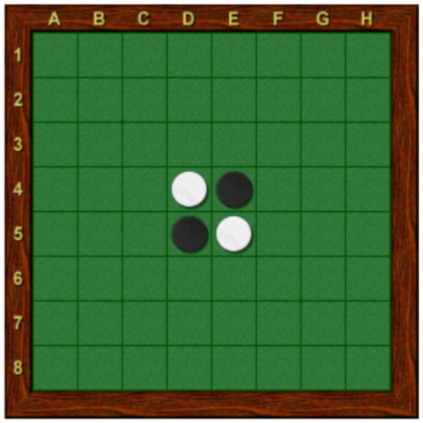

# 6 Othello

Vašou úlohou bude naprogramovať bota, ktorý bude vedieť hrať hru Othello (Revesi). Pravidlá sú na https://en.wikipedia.org/wiki/Reversi#Modern_version (moderná verzia). Vyskúšať hru si môžete zadarmo na internete, napríklad na https://www.eothello.com/, kde sú znovu aj popísané pravidlá.

Vstup a výstup z vašej aplikácie bude štandardný vstup a výstup. Váš main by mal vyzerať +- nejak takto.

```
#include <iostream>
#include <string>

int main()
{
    std::string command;
    while (std::getline(std::cin, command))
    {
        std::string result;
        // process the command and fill result
        std::cout << result << std::endl;
    }
}
```
Na vstupe budete mať príkazy, oddelené novým riadkom. Na výstup zapíšete vždy vašu odpoveď. Príkazy budú tri typy.

- ```START```, ktorý bude mať dva parametre, najpr ```B```, alebo ```W``` podľa toho či hráte za čierneho, alebo bieleho a potom kladné celé číslo, ktoré hovorí koľko budete mať času na jeden ťah v sekundách. Odpovedať by ste mali do zadaného počtu sekúnd so stringom ```1``` a novým riadkom (```std::endl```, nech sa to aj flush-ne).
  - ```START W 30```, znamená, že hráte za bieleho a máte 30 sekúnd na ťah
  - ```START B 5```, znamená hru za čierneho a 5 sekúnd na ťah
  - ```START W 0``` je neplatný vstup, lebo 0 nie je kladné celé čislo.
- ```STOP```, bez parametrov, ktorý hovorí, že máte aplikáciu ukončiť, naň odpovedať nemusíte, stačí ak proces skončí so statusom 0.
- ```MOVE``` s jedným parametrom v ktorom bude zakódovaný stav hry a vy máte na výstup odpovedať aký ťah podniknete, teda číslo políčka.  

Kedykoľvek vaša aplikácia zaregistruje nejakú chybu (napr. zo vstupu) mala by to zahlásiť na ```std::clog``` (```std::cout``` je súčasťou protokolu na neho nesmiete vypisovať nič iné ako žiada protokol) a ukončiť sa so statusom ```>0```.

## Kódovanie
Políčka sú v hre Othello číslované nasledovne



Pri odpovedaní ťahom musíte použiť identifikáciu políčka ako ```A1```, ```E6``` alebo ```H8``` (musí byť upper case).

Celý stav hry bude zakódovaný v jednom reťazca s presne ```64``` znakmi. Znak ```-``` je prázdne políčko, ```O``` je biely a ```X``` je čierny. Hracia plocha je uložená od ```A1``` po riadkoch až k ```H8```. Teda napríklad začiatočná pozícia je
```
---------------------------OX------XO---------------------------
```

## Protokol
Na začiatok vám príde ```START``` príkaz, tu si uložíte za koho hráte a koľko máte času. Potom vám pár krát príde ```MOVE``` a na záver ```STOP```.  Na všetky príkazy treba odpovedať do časového limitu špecifikovaného v ```START``` príkaze. Realisticky budete mať ```2-30``` sekúnd na odpoveď.

## Implementácia
Ako to naprogramujete je na vás, asi budete potrebovať niečo ako move generator a potom minimax search. Pozor môže stať, že pôjdete dva krát po sebe, ak oponent nemá žiaden ťah, tak sa vynechá. Máme naprogramovaného hráča, ktorý hra podľa funkcie ```rand()```, keď toho porazíte, tak máte 6 bodov istých.

Ešte pár slov k časovému limitu. Testovacia aplikácie vám dá ešte plus mínus trochu času aby ste stihli odpovedať, teda stačí ak po časovom limite zastavíte výpočet a odpoviete. V zásade sú dve možnosti ako to spraviť.

1. Každú chvíľu sa spýtate na aktuálny time() a ak už treba končiť tak return. Pýtať sa ale každú chvíľu na čas nevyzerá moc pekne.
2. Spustíte si jeden thread, ktorý necháte čakať daný čas (v podstate aj sleep by sa dal na toto dobre použiť, lepšie ale použiť CV), ten neskôr nastaví bool (pozor, ten musí byť atomic). Ostatné thready si budú kontrolovať tento bool.

#### Bonusové dva body:

S aplikáciami, ktoré budú kompilovateľné a porazia random hráča, sa usporiada turnaj každý s každým (dva zápasy, aby bol každý aj za bieleho aj za čierneho). Prvé tri miesta získajú dva body a ďalších 5 potom jeden bod (toto ešte môžem upraviť, podľa toho ako to bude vyzerať, ak budú príliš dobré riešenia, tak bude viac bodov). Vaše aplikácie sa budú spúšťať ako nový proces, teda máte svoje 2GB pamäte, kde si môžete robiť čo chcete. Inak sa ale nesnažte zahltiť systém, teda žiadne súbory a keď práve nič nepočítate, teda ak nieste na ťahu, tak žiadne vyťažovania procesora. Do zdrojákov si môžete niečo predpočítať, ale vaše súbory nesmú mať viacej ako ```+-1MB```.

Po zvážení pravidiel použijeme systém, výhra je 1 bod, prehra je 0 bodov a remíza je 0,5 boda. **Pôvodne som hovoril o tom, že budeme počítať ako veľmi vyhráte, teda kto má koľko kameňov na konci, ale takto to bude lepšie**.
