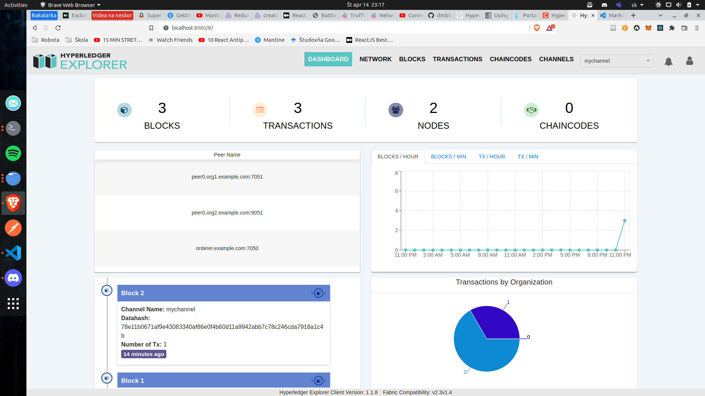
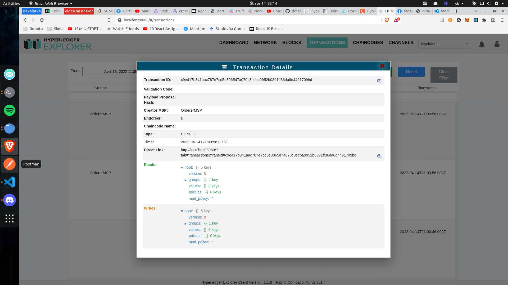

# Roman Páleník - minizadanie 3

## Zadanie:

1. Rozbehať Fabric v2.x. https://hyperledger-fabric.readthedocs.io/en/latest/write_first_app.html#set-up-the-blockchain-network
2. Rozbehať jednoduchý chaincode na výmenu assetov. https://hyperledger-fabric.readthedocs.io/en/latest/write_first_app.html
3. Rozbehať Explorer. https://github.com/hyperledger/blockchain-explorer
4. Spraviť výmenu assetov s tým, že budem mať 3 peerov, Alicu, Boba a Cyrila. ⁃ Vymenu spravim tak, ze Alica bude mať na začiatku 10 assetov, pošle 5 Bobovi a 5 Cyrilovi. ⁃ Potom Cyril pošle 2 Alici a 3 Bobovi.
5. Všetko ukázať v transakciách a blokoch pomocou Exploreru.
   Odovzdať zdrojáky do AIS a screenshoty preukazujúce funkčnosť.

## Riešenie

### 1 bod - Rozbehaný Fabric + Explorer

Na obrázku môžete vidieť ako sa mi podarilo rozbehať HyperLedger explorer

### 2 bod - Ukázané akékoľvek transakcie v Exploreri

Na obrázku nižšie ukazujem jednu konkrétnu transakciu v kanáli mychannel

### 3 bod - Spravený presne use-case popísaný vyššie a dokázané screenshotmi

Tento bod som nestihol doiplementovať
