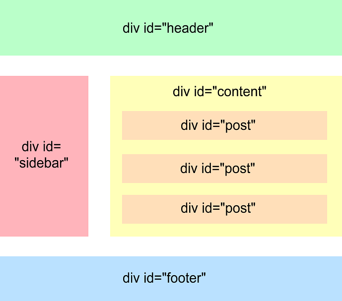
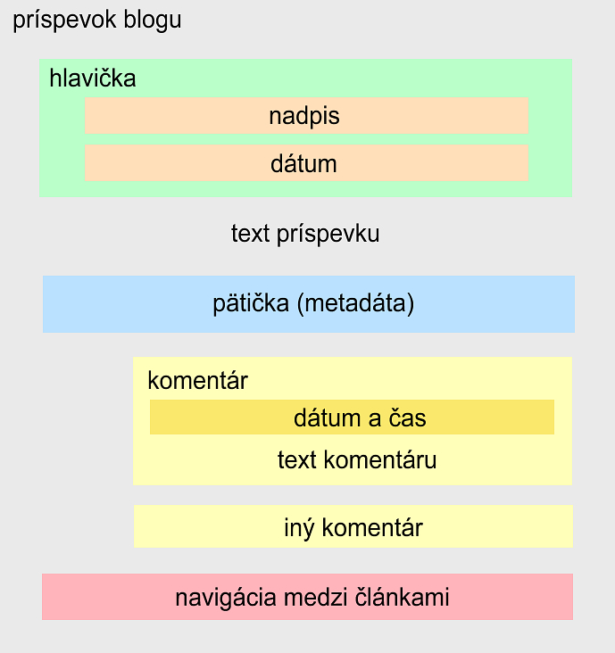

### Príklad 1
Vytvorte kostru HTML5 dokumentu.

### Príklad 2
Ako vyzerá osnova tohto HTML dokumentu ("zverstva")?

```html
<body>
    <h1>Nadpis A</h1>
    <section>
        <h1>Nadpis B</h1>
    </section>
    <h2>Nadpis C</h2>
    <h3>Nadpis D</h3>
    <section>
        <h5>Nadpis E</h5>
        <h5>Nadpis F</h5>
        <h6>Nadpis G</h6>
        <section>
            <h1>Nadpis H</h1>
        </section>
    </section>
    <section>
        <h1>Nadpis I</h1>
    </section>
</body>
```

### Príklad 3
Vytvorte najskôr v HTML4 a potom v HTML5 takúto osnovu dokumentu:

1. Letné športy a aktivity v prírode
    1. Turistika
        1. História turistiky
        2. Význam turistiky, pohybu a pohybu v prírode
        3. Druhy turistiky
    2. Geocaching a hry s GPS
        1. Charakteristika a história Geocachingu
            1. Pojmy súvisiace s navigačnou hrou Geocaching
        3. Súčasný stav Geocachingu vo svete a na Slovensku
    3. Orientačný beh
        1. Základné pojmy
        2. Orientačné športy
    4. Horská cyklistika
2. Hry v letnej prírode
    1. Charakteristika hier v letnej prírode
    2. Didaktická stránka realizácie hier v letnej prírode


### Príklad 4
Prerobte túto HTML štruktúru do správnej HTML5 štruktúry s použitím nových elementov:

```
<div id="wrapper">
  <header>  
    <h1>Moja super-truper stránka</h1>
  </header>
  <section id="main">
    <!-- page content -->
  </section>
  <section id="secondary">
    <!-- secondary sidebar - related content -->
  </section>
  <footer>
    <!-- footer content -->
  </footer>
</div>
```


### Príklad 5
Uvažujte blog s príspevkami (článkami, angl. blog post). HTML štruktúra mnohých blogov vyzerá aj v súčasnosti, napr. takto:




Inšpirujte sa týmto rozložením stránky (angl. page layout) a vytvorte HTML5 štruktúru s použitím nových elementov.
   
   
 Anatómiu príspevku blogu (post) ilustruje tento obrázok:


