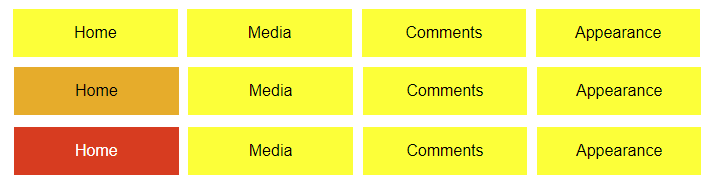
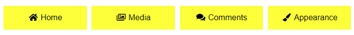

# Príklady na precvičenie

  

## Príklad 1

Naštýlujte tieto odkazy tak, aby vyzerali ako tlačidlá, ktoré ilustruje predloha. Farba tlačidla bude žltá, aj v prípade, že už bol odkaz navštívený. Keď je kurzor myši nad tlačídlom, zmení sa jeho farba na oranžovú. Keď na tlačidlo klikneme, bude červené.

  

```html

<ul>

<li><a  href="#">Media</a></li>

<li><a  href="#">Pages</a></li>

<li><a  href="#">Comments</a></li>

<li><a  href="#">Appearance</a></li>

</ul>

```

  



  

## Príklad 2

Pridajte do stránky k vytvoreným tlačidlám písmo *Font Awesome*. K jednotlivým položkám menu pridajte ikony, ktoré reflektujú jednotlivé položky, príp. sa inšpirujte nasledujúcou predlohou.

  

