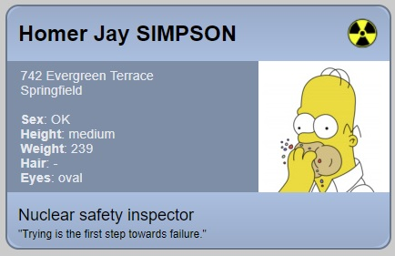

# Cvičenie 4 - CSS základy, selektory, box model

<a name="c4-priklady"></a>
## Príklady na precvičenie

## Príklad 1
Určte mieru konkrétnosti týchto CSS selektorov:
* `h1`
* `#important`
* `.bold`
* `h1 + p::first-letter`
* `ul ol+li`
* `h1 + *[rel=up]`
* `body #darkside .sith p`
* `body #content[data-preview^="case"] .data img:hover::after`

### Príklad 2 
Vytvorte HTML elementy (celú potrebnú hierarchiu), ktorá zodpovedá každému z vyššie uvedených selektorov.

### Príklad 3
Čo je CSS box model? Ktoré CSS vlastnosti sú jeho súčasťou?

### Príklad 4
Aká je šírka a výška tohto bloku (boxu)?
```html
div {
    width: 200px;
    height: 110px;
    padding: 25px 10px;
    border-right: 25px solid navy;
    margin: 0;
    outline: #4caf50 solid 100px;
    background-color: rgba(0,0,255,0.2);
}
``` 

### Príklad 5 - Homerova pracovná vizitka
Vašou úlohou je vytvoriť jednoduchú pracovnú vizitku Homera Simpsona, jej vizuálne prevedenie by sa malo čo najviac približovať tomuto:



Stiahnite si súbory:
* [homer.jpg](zdroje/homer.jpg)  
* [nuclear-power-logo.png](zdroje/nuclear-power-logo.png)  
* [id-card.html](zdroje/id-card.html)     
* [id-card-styles.css](zdroje/id-card-styles.css)  

V súbore `id-card.html` máte predpripravenú šablónu. V pripojenom súbore `id-card-styles.css` (zatiaľ zakomentovanom - nie je validný) máte predpripravené niektoré štýly. Je definovaných niekoľko selektorov a rovnaký počet deklaračných blokov. Nie sú v tom istom poradí, a teda je potrebné ich správne "spárovať". Je tiež potrebné vytvoriť ďalšie pravidlá, aby ste docielili rovnaký vizuál s predlohou. Mali by ste si vystačiť s aktuálnou HTML šablónou, a teda nie je potrebné pridávať ďalšie elementy, príp. atribúty.

Pozn.: [Zdroj použitého obrázku Homera Simpsona](http://www.simpsoncrazy.com/pictures/homer).

 ## Slovník, preklad anglických pojmov
 * margin - vonkajší okraj
 * padding - vnútorný okraj
 * border - rámik
 * inline element - riadkový element
 * block element - blokový element
 * inline style - štýl definovaný atribútom style
 * internal style - interný štýl definovaný elementom `<style>`  
 * external style - externý štýl pripojený k dokumentu cez element `<link>`
 * viewport - viditeľný výrez (webovej stránky)
 * specificity - miera konkrétnosti
 * CSS box model - CSS blokový model
 * overflow content - pretekajúci obsah
 * (element) outline - obrys elementu
 
 
  